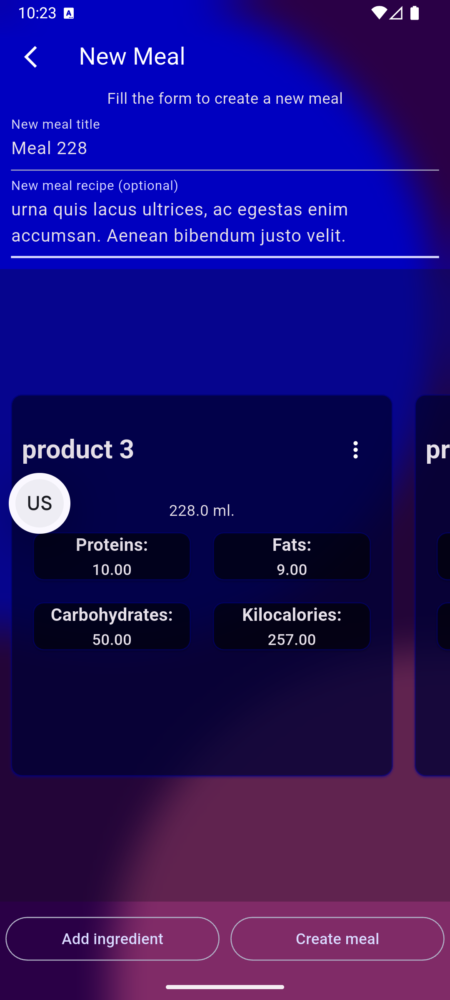

# App

FitApp is a mobile application, which helps user to organize training process and nutrition.

## Screenshots

### Home screen - displays user current weight


### Application drawer


### Trainings list


### Training creation form.


### Adding an exercise with repetition in a training.


### Adding an exercise with timer in a training


### By tap on exercise card, training information shows up.
#### User can start a training with 'Start training button'


### To complete a training, mark each exercise as completed


### Run timer to observe remaining time of exercise execution.


### After all exercises are completed, finish the training.


### Watch statistics of exercises you did.
#### The more load you set for an exercise, the more progression statistics display.


### Each time you complete a training with increased load, statistics gets updated.


### Add products and mention their nutrition facts...


### ... using creating product form. Don't forget to mention, if current product should me measured either in grams or in mililiters  


### With those products you can create meals.


### By tap on meal, it's recipe and ingredients show up.


### Creating meal form.



### Adding an ingredient in a new meal.


### You can customize user interface and set interface language in settings.


### So application may look like this:


### Don't forget to update your current weight


## Features

With FitApp user can
- Create a training, which may include exercises, such as repetitions exercise, or exercise with timer,
- Complete a creating training exercise by exercise,
- Watch training progression with exercise statistics chart,
- Create meals with different products and watch it's nutrition facts.

## Getting Started

Before you start this application, make sure you have a JSON configuration file in root.
It's structure is presented below:
```json
{
  "fitapp_environmentName": "dev",
  "fitapp_applicationName": "FitApp",

  "fitapp_user_box_name": "dev_user_box",
  "fitapp_user_key_name": "dev_user_key",

  "fitapp_settings_box_name": "dev_settings_box",
  "fitapp_settings_key_name": "dev_settings_key"
}
```

Also don't forget to mention this file in run script with flag `--dart-define-from-file=fitapp_dev.env.json`

To start application in dev mode with using Hive, run 'main_dev' configuration.

If you want to run application in dev mode with mock data without Hive, you can use 'main_dev_mock' configuration.

To build APK file, run 'build apk' script.
